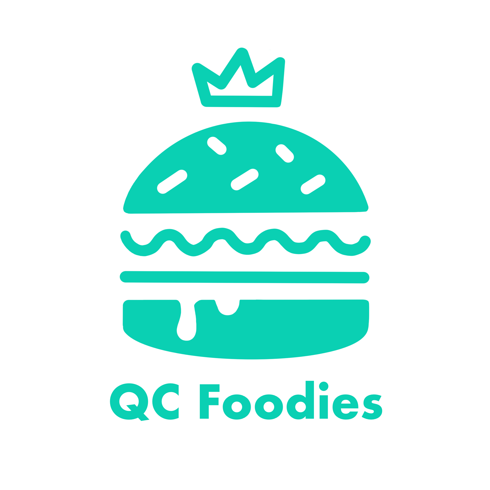
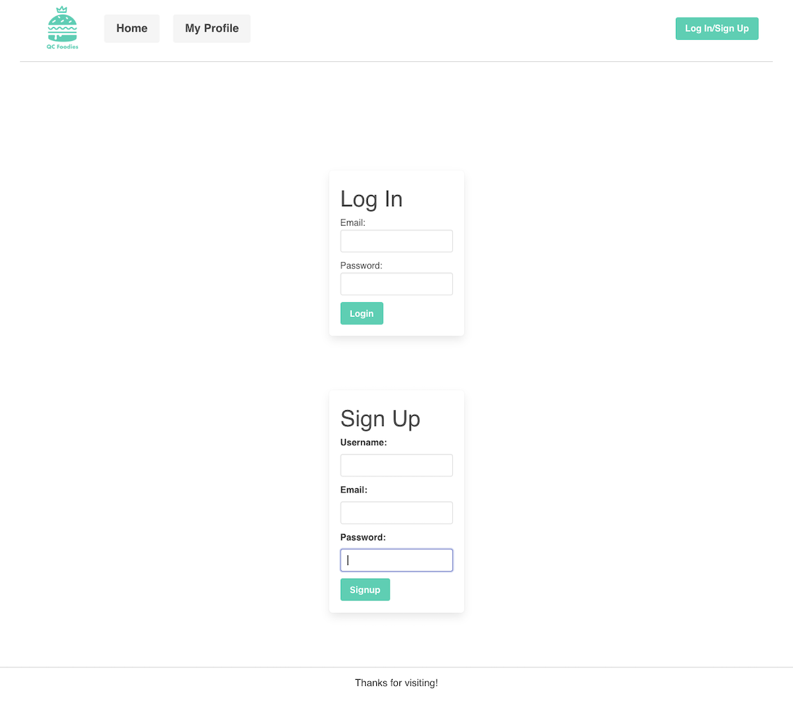
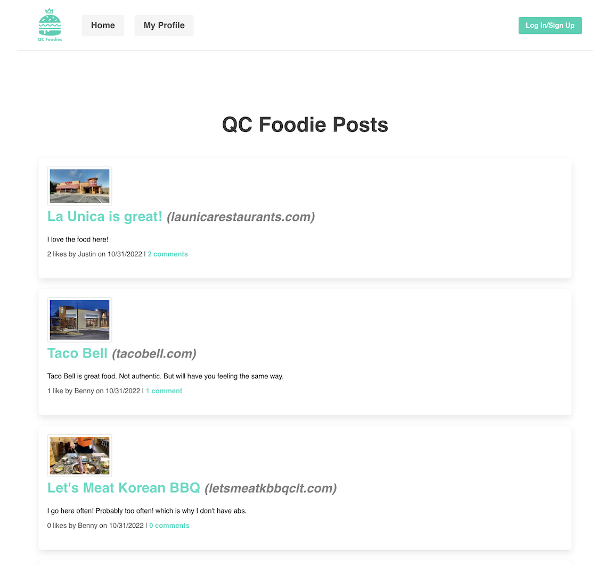
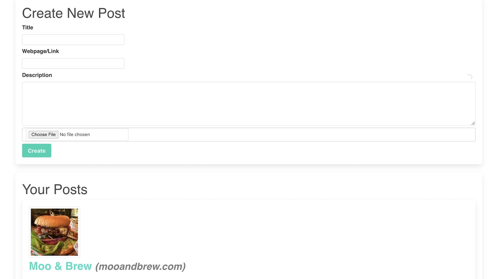
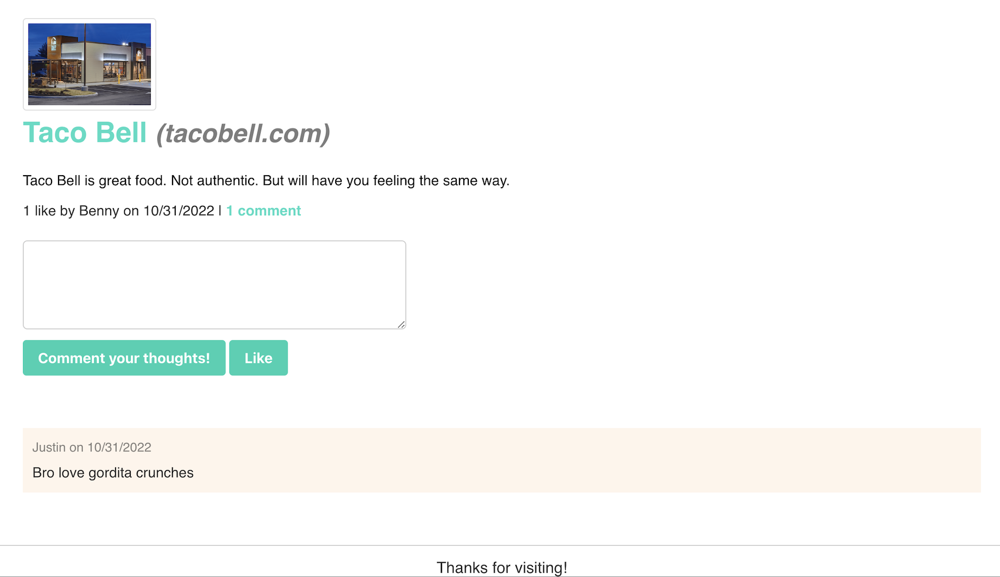

 

# **QC-Foodies**

## **Table of Contents** 

- [Website URL](#websiteURL)
- [Description](#description)
- [Technology](#technology)
- [Installation](#installation)
- [Usage](#usage)
- [Team Shooting-Stars](#team-shooting-stars)
- [License](#license)

---

## **Website URL**

[https://heroku](https://qc-foodies.herokuapp.com/)

## **Description**

QC Foodies is a food blog created by 4 individuals based in Charlotte, NC. Here, you can share your thoughts on different dishes from restaurants or recipes.

For the fun time lovers who replace their food with drinks, we offer a brewery option as well. 

Navigate through the page, utilizing the homepage or the navbar on the top of the page. 

Log-in to keep up with other QCFoodies and interact with them as well. Create your own post (including a photo) or add a comment on other user's posts based on your experience if you had the same food or drink. Rate or like the post. 

QC Foodies is Charlotte based, however open to the Foodie posts from other areas of the world! Share your favorites with other interested foodies! 

---

## **Technologies Used**
- MVC paradigm
    (models, views, controllers)
- MySQL/Sequelize 
- Node.js
- Cloudinary
- UUID
- Nodemon
- Dotenv
- Express
- Handlebars
- Multer
- Bcrypt

---

## **Installation**

Once application is forked, npm install will be required. Update .env for database username and password is required (mySQL account required). 

Heroku account required, to enable deployment of application through Heroku.

## **Usage**

Step 1: Create username and password through sign-up

Step 2: Log-in

Step 3: Navigation

Step 4: Create your own post or comment/like other user's posts

---

## **Team Shooting-Stars**

- Justin Klaver - [https://github.com/Jklaver91](Jklaver91)
- Benny Le - [https://github.com/bennyle890](bennyle890)
- Austin Reed - [https://github.com/areed98](areed98)
- Allison Venning - [https://github.com/allisonvenning](allisonvenning)

## **License**

### Thanks for visiting our Project!
